<!-- <h3><code>bhaikd@github ~ $ ./contributions.sh</code></h3> -->

  

<h3><code>bhaikd@github ~ $ whoami</code></h3>
<table>
  <tr>
    <td valign="top"></td>
    <td valign="top"></td>
  </tr>
</table>

---

# 💫 About Me

I am a driven developer dedicated to the art of rapid execution and collective problem-solving. Currently, I focus on architecting MVP models that transform complex ideas into functional products, while actively contributing to the open-source community. I believe in building transparent, scalable code that not only solves immediate user needs but also contributes to the wider ecosystem of shared knowledge.

## 🌐 Socials:

 

# 💻 Tech Stack:

                            
